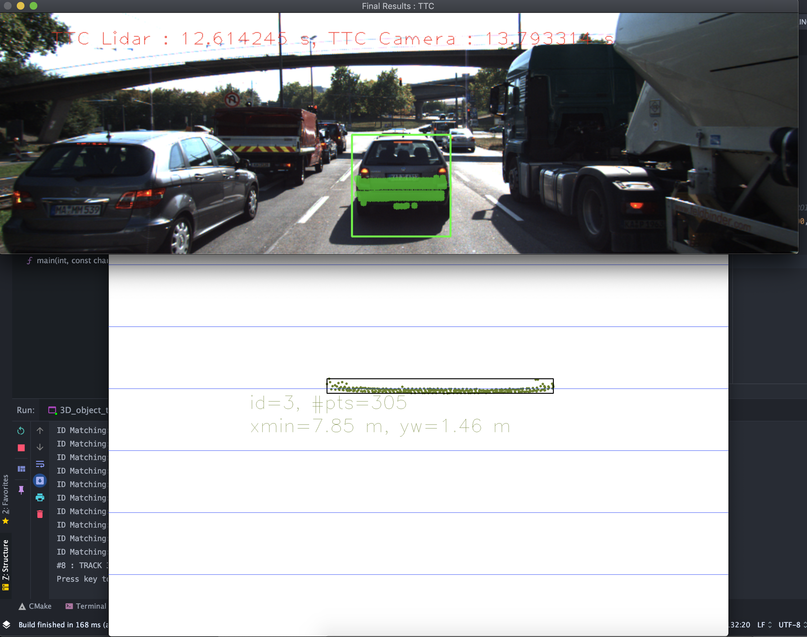
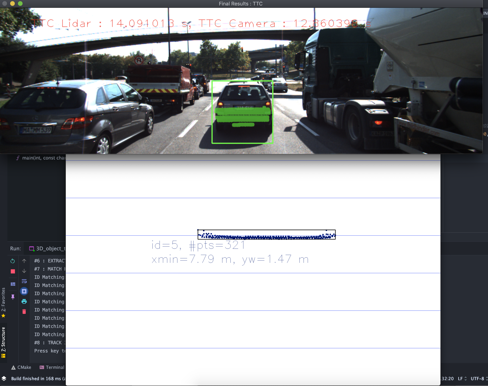
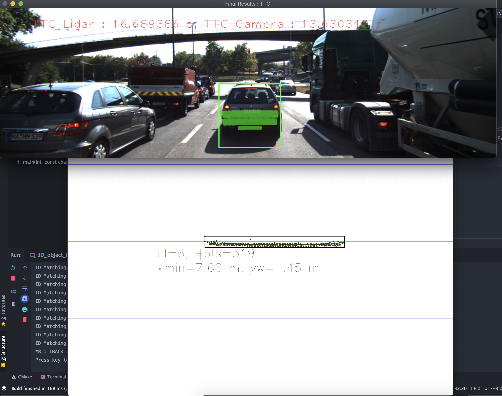
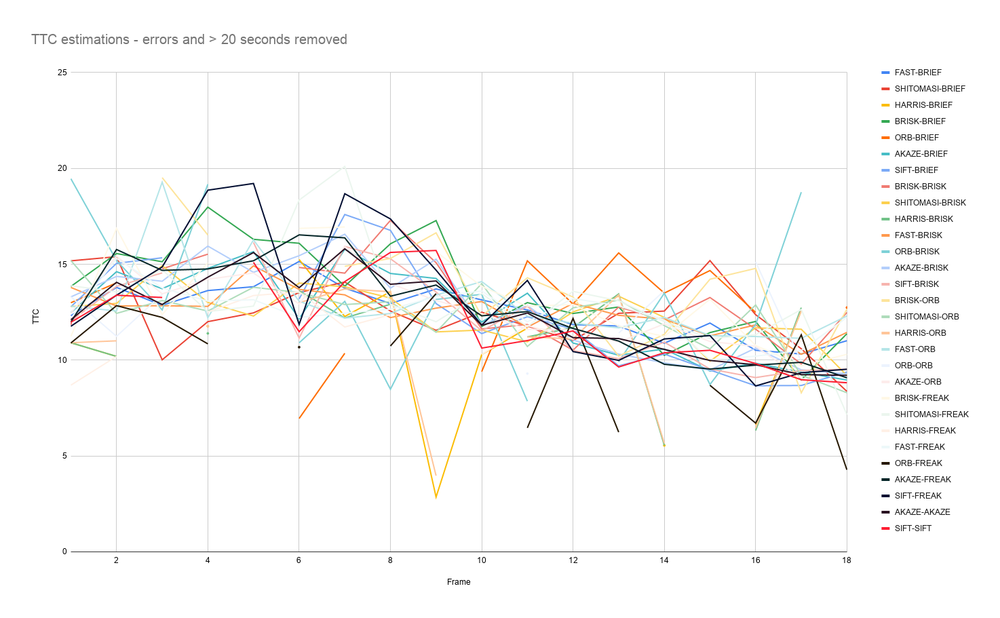
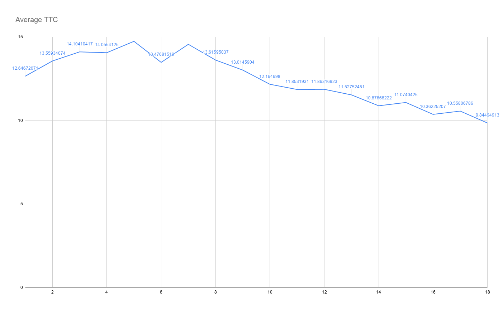
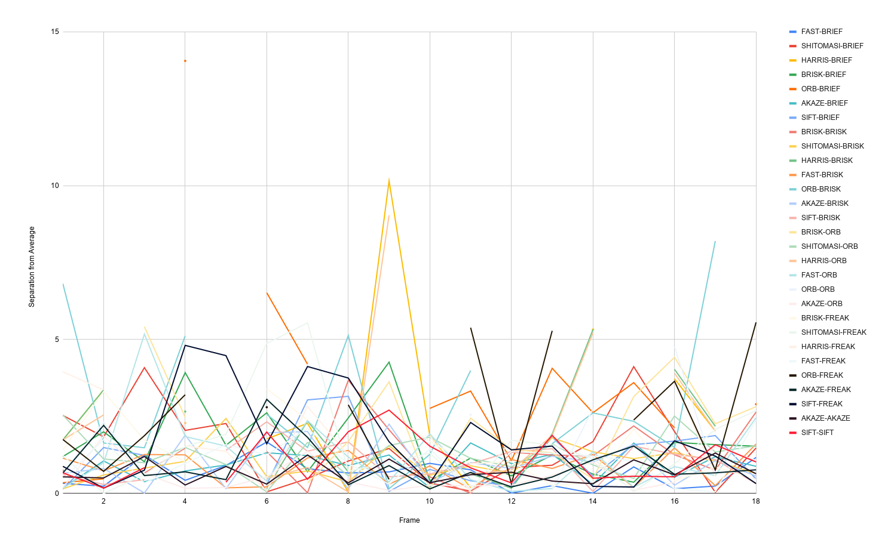
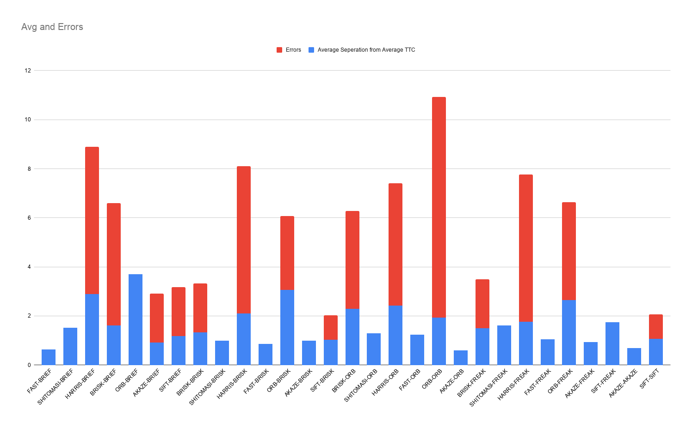

#FP.1 Match 3D Objects
This was accomplished by nested looping through both previous and current
bounding boxes and finding matches that were contained in a given pair of
boxes and counting them. Then the matches with the most matches are said
to be the best matches.

#FP.2 Compute Lidar-based TTC
Both the previous and current frame lidar points are pushed into sorted
vectors. Then, the closest point, of which meets the condition that 3
other points are within 2 cm, is used to compute the TTC.

###*Resubmission*

I have implemented the reviewers suggestions with regards to accounting
for a larger amount of points for the TTC computation. This solution
works a lot more consistently. I think in a real world program, this
method would need some revision to take into account something like
a pickup truck - where points would be measured from the tailgate and
cab.

#FP.3 Associate Keypoint Correspondences with Bounding Boxes
Key point matches within the bounding box and the range of 80% and 120%
of the mean match distances are kept as bounding box matches and keypoints.

###*Resubmission*

I have taken the reviewers advice again in very much simplifying my code.
I have much better results now. I was under the impression that this
function was to fill the bb.keypoints attribute as well.

#FP.4 Compute Camera-based TTC
Distances and TTC are computed based on the pinhole phenomenon.

###*Resubmission*

I foolishly forgot to sort the ratios, the reviewers code helped me figure this
out and get much better results. ~~With both the reviewer and myself's code
one TTC computation is -inf, is this acceptable?~~ After implementing the much
simpler roi clustering function that the reviewer suggests - this is fixed.

#FP.5 Performance Evaluation 1
When the proceeding vehicle's distance is further in the
current frame from the previous - I believe the calculation
of TTC is incorrect and too high.

###*Resubmission*

It seems, as can be seen in the screenshots below, that in frames 3-5 the
vehicle is getting closer but the TTC is increasing. This may be because
of noise points throwing off the minimum distance median calculation. A
rogue point can be seen in frame 5's top down view.

###Frame 3

###Frame 4

###Frame 5

#FP.6 Performance Evaluation 2
When the number of keypoints for an image are low
the TTC estimation is faulty. Low match confidence can lead to
severe differences from the lidar TTC.

###*Resubmission*

Below is a plot of all TTC calculations given different pairs of detectors
descriptors. Errors and unreasonable results over 20 seconds are removed.

Below is the average TTC estimation of all pairs for each frame. This is what
we will use as the 'truth' in out analysis.

The graph below represents each pair of detector and descriptor's offset from
our 'truth' TTC (the average TTC).

In the graph below each pair of detectors and descriptors are represented with
their average closeness to the 'truth' and the number of errors or fault data
recorded. We can see that FAST/BRIEF, AKAZE/ORB, and AKAZE/AKAZE performed the 
best in this measurement of accuracy.
